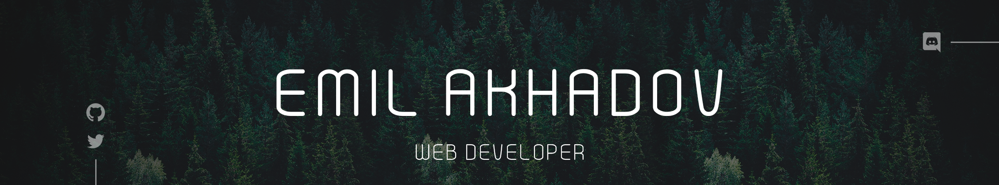

</img>
<h3 align="center">
    Hey there, I'm 
    <a href="https://github.com/Kanzai79">Emil</a> - aka Kanzai 
    </img>
</h3>

    
     
    
    

## 🙋🏻‍♂️ About Me.

<ul>
  <li>💻 I'm a full stack web developer</li>
  <li>🎨 I'm a self-taught UI designer</li>
  <li>🎓 I'm a Computer Science student</li>
  <li>🧙🏻‍♂️ Doctor of Minecraft Science</li>
  <li>🌚 You can see some of my projects on <a href="https://kanzai79.github.io/">my portfolio</a></li>
</ul>

<!-- * 💻 I'm a full stack web developer
* 🎨 I'm a self-taught UI designer
* 🎓 I'm a Computer Science student
* 🧙🏻‍♂️ Doctor of Minecraft Science
* 🌚 You can see some of my projects on [my portfolio]() -->

  
    

## ⚔️ My main stack

##### Languages and Frameworks

<table>
  <tr>
    <td></td>
    <td></td>
    <td></td>
    <td></td>
    <td></td>
  </tr>
  <tr>
    <td></td>
    <td>
    
    </td>
    <td>
    
    </td>
    <td>
    
    </td>
  </tr>
</table>

##### Databases
<table>
  <tr>
    <td></td>
    <td></td>
    <td></td>
  </tr>
</table>

##### OS
<table>
  <tr>
    <td></td>
    <td></td>
    <td></td>
  </tr>
</table>

 

## 🤖 Github Stats

  
<strong>CLICK HERE . . .</strong>

   
  

    </img>
  

  

    </img>
    </img>
  

  ___
  
  

    </img>
    </img>
  

  

    </img>
  

 

<table>
<tr>
    <th colspan="2">📢 Latest Tweets</th>
  </tr>
  <tr>
    <td colspan="2">
      <a href="https://twitter.com/Kanzai79">
        </img>
      </a>
    </td>
  </tr>
  <tr>
    <th>🎵 Favorite music tracks</th>
    <th>🎧 Recently listened to music</th>
  </tr>
  <tr>
    <td>
      <a href="https://open.spotify.com/user/r7j3tuko5htlf1ig3mv53caek">
        </img>
      </a>
    </td>
    <td>
      <a href="https://open.spotify.com/user/r7j3tuko5htlf1ig3mv53caek">
        </img>
      </a>
    </td>
  </tr>
</table>

 

⬇️ Scroll down to see my repos! ⭐ Stars are appreciated!

    

